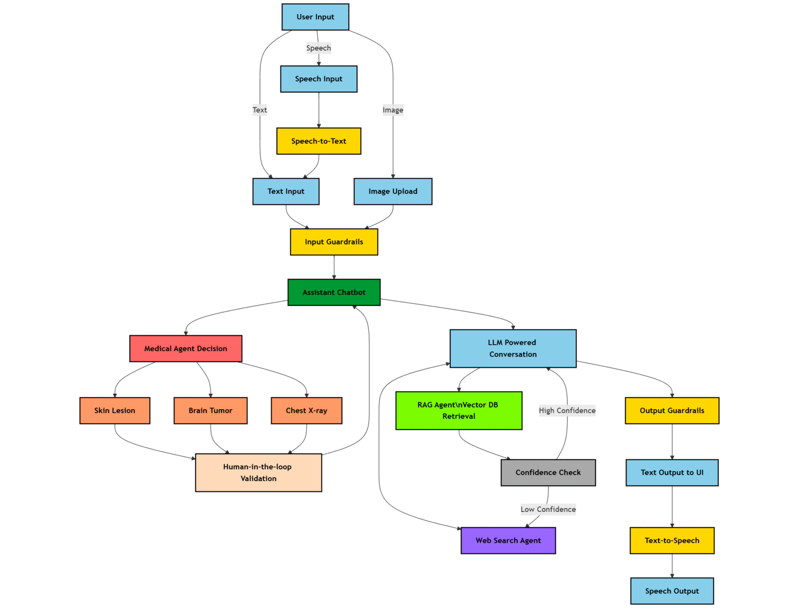

<div align="center">

# ⚕️ 多智能体医疗助手

**基于多agent的多智能体医疗诊断与辅助系统**

</div>

---

## 📚 目录

- [概述](#概述)
- [技术流程图](#技术流程图)
- [核心功能](#核心功能)
- [技术栈](#技术栈)
- [安装与配置](#安装与配置)
  - [方式一：使用 Docker](#方式一使用-docker)
  - [方式二：手动安装](#方式二手动安装)
- [使用方法](#使用方法)

---

## 📌 概述

**多智能体医疗助手** 是一个基于 AI 驱动的聊天机器人，旨在辅助医疗诊断、研究和患者交互。

该系统由多智能体智能驱动，集成了以下核心能力：

- **大语言模型 (LLMs)** — 自然语言理解与生成
- **计算机视觉模型** — 医学影像分析
- **检索增强生成 (RAG)** — 基于向量数据库的知识检索
- **实时网络搜索** — 获取最新医学信息
- **人机协同验证** — 对 AI 医学影像诊断进行专家审核

---

## 🛡️ 技术流程图



---

## ✨ 核心功能

### 多智能体架构

专业化智能体协同工作，处理诊断、信息检索、推理等任务。

### 高级 RAG 检索系统

- 基于 Docling 解析 PDF，提取文本、表格和图像
- 嵌入 Markdown 格式的文本、表格及基于 LLM 的图像摘要
- 基于 LLM 的语义分块，感知文档结构边界
- 基于 LLM 的查询扩展，补充相关医学领域术语
- Qdrant 混合搜索（BM25 稀疏关键词 + 稠密嵌入向量）
- HuggingFace Cross-Encoder 重排序，提升响应准确性
- 输入输出护栏，确保安全和相关的响应
- 响应附带源文档链接及参考文档中的图像
- 基于置信度的 RAG 与网络搜索智能体间交接，防止幻觉

### 医学影像分析

| 任务 | 模型类型 | 状态 |
|------|---------|------|
| 脑肿瘤检测 | 目标检测 (PyTorch) | 待开发 |
| 胸部 X 光疾病分类 | 图像分类 (PyTorch) | 已完成 |
| 皮肤病变分割 | 语义分割 (PyTorch) | 已完成 |

### 其他功能

- **实时研究集成** — 网络搜索智能体检索最新医学研究论文和发现
- **基于置信度的验证** — 通过对数概率分析确保医学建议的高准确性
- **语音交互** — Eleven Labs API 驱动的语音转文字 / 文字转语音
- **专家监督系统** — 医学专业人员在最终输出前进行人机协同验证
- **输入与输出护栏** — 过滤有害或误导性内容，确保安全可靠的医学响应
- **直观的用户界面** — 为技术基础较少的医疗专业人员设计

> [!NOTE]
> **即将推出：**
> 1. 脑肿瘤医学计算机视觉模型集成
> 2. 欢迎提出建议和贡献

---

## 🛠️ 技术栈

| 组件 | 技术方案 |
|------|---------|
| 后端框架 | FastAPI |
| 智能体编排 | LangGraph |
| 文档解析 | Docling |
| 知识存储 | Qdrant 向量数据库 |
| 护栏 | LangChain |
| 语音处理 | Eleven Labs API |
| 前端 | HTML / CSS / JavaScript |
| 部署 | Docker / GitHub Actions CI/CD |

---

## 🚀 安装与配置

### 前置条件

- Python 3.11+
- 所需服务的 API 密钥（详见下方环境变量配置）

### 环境变量配置

在项目根目录创建 `.env` 文件，填入以下内容：

> [!NOTE]
> 你可以选择任意 LLM 和嵌入模型：
> 1. 使用 Azure OpenAI — 无需额外修改
> 2. 使用 OpenAI 直连 — 需修改 `config.py` 中的 LLM 和嵌入模型定义
> 3. 使用本地模型 — 需在代码库（尤其是 `agents/`）中进行相应修改

> [!WARNING]
> 请确保 API 密钥正确且具有必要权限。变量名后不要有尾随空格。

```bash
# ===== LLM 配置 =====
# 开发中使用 Azure OpenAI - gpt-4o
deployment_name=
model_name=gpt-4o
azure_endpoint=
openai_api_key=
openai_api_version=

# ===== 嵌入模型配置 =====
# 开发中使用 Azure OpenAI - text-embedding-ada-002
embedding_deployment_name=
embedding_model_name=text-embedding-ada-002
embedding_azure_endpoint=
embedding_openai_api_key=
embedding_openai_api_version=

# ===== 语音 API =====
# 新建 Eleven Labs 账户可获得免费额度
ELEVEN_LABS_API_KEY=

# ===== 网络搜索 API =====
# 新建 Tavily 账户可获得免费额度
TAVILY_API_KEY=

# ===== HuggingFace =====
# 重排序模型 ms-marco-TinyBERT-L-6
HUGGINGFACE_TOKEN=

# ===== Qdrant（可选）=====
# 仅使用 Qdrant 服务器版本时需要，本地版本无需配置
QDRANT_URL=
QDRANT_API_KEY=
```

---

### 方式一：使用 Docker

#### 前置条件

- 系统已安装 [Docker](https://docs.docker.com/get-docker/)

#### 1. 克隆仓库

```bash
git clone https://github.com/souvikmajumder26/Multi-Agent-Medical-Assistant.git
cd Multi-Agent-Medical-Assistant
```

#### 2. 构建镜像

```bash
docker build -t medical-assistant .
```

#### 3. 运行容器

```bash
docker run -d --name medical-assistant-app -p 8000:8000 --env-file .env medical-assistant
```

应用地址：[http://localhost:8000](http://localhost:8000)

#### 4. 导入数据到向量数据库

导入单个文档：

```bash
docker exec medical-assistant-app python ingest_rag_data.py --file ./data/raw/brain_tumors_ucni.pdf
```

导入目录下所有文档：

```bash
docker exec medical-assistant-app python ingest_rag_data.py --dir ./data/raw
```

#### 容器管理

```bash
docker stop medical-assistant-app     # 停止容器
docker start medical-assistant-app    # 启动容器
docker logs medical-assistant-app     # 查看日志
docker rm medical-assistant-app       # 删除容器
```

#### 故障排除

```bash
# 查看容器健康状态
docker inspect --format='{{.State.Health.Status}}' medical-assistant-app

# 查看错误日志
docker logs medical-assistant-app
```

---

### 方式二：手动安装

#### 1. 克隆仓库

```bash
git clone https://github.com/souvikmajumder26/Multi-Agent-Medical-Assistant.git
cd Multi-Agent-Medical-Assistant
```

#### 2. 创建并激活虚拟环境

使用 conda：

```bash
conda create --name medical-assistant python=3.11
conda activate medical-assistant
```

使用 venv：

```bash
python -m venv venv
source venv/bin/activate        # Mac / Linux
venv\Scripts\activate           # Windows
```

#### 3. 安装依赖

> [!IMPORTANT]
> 语音服务需要安装 ffmpeg。

```bash
# 安装 ffmpeg（二选一）
conda install -c conda-forge ffmpeg   # conda
winget install ffmpeg                 # Windows

# 安装 Python 依赖
pip install -r requirements.txt
```

#### 4. 运行应用

```bash
python app.py
```

应用地址：[http://localhost:8000](http://localhost:8000)

#### 5. 导入数据到向量数据库

```bash
# 导入单个文档
python ingest_rag_data.py --file ./data/raw/brain_tumors_ucni.pdf

# 导入目录下所有文档
python ingest_rag_data.py --dir ./data/raw
```

---

## 🧠 使用方法

> [!NOTE]
> 首次运行注意事项：
> 1. 首次运行可能不太稳定 — 请耐心等待控制台中的模型下载完成
> 2. 需要下载的模型包括：YOLO (OCR)、计算机视觉模型、Cross-Encoder 重排序模型等
> 3. 下载完成后重启应用即可正常使用

- **医学影像诊断** — 上传医学影像，由计算机视觉智能体进行 AI 辅助分析（可使用 `sample_images/` 中的样本图像体验）
- **医学知识问答** — 提问医学问题，系统通过 RAG 检索或网络搜索获取相关信息
- **语音交互** — 支持语音转文字输入和文字转语音输出
- **人机协同审核** — 对 AI 生成的分析结果进行专家验证
